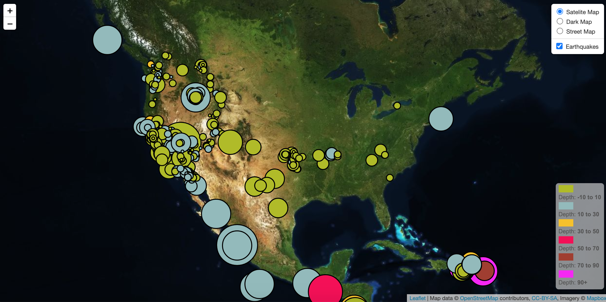

# Leaflet Homework - Visualizing Data with Leaflet

## Background

Welcome to the United States Geological Survey, or USGS for short! The USGS is responsible for providing scientific data about natural hazards, the health of our ecosystems and environment; and the impacts of climate and land-use change. Their scientists develop new methods and tools to supply timely, relevant, and useful information about the Earth and its processes. I have created a map of the last 7 days earth quakes as per the image above.

1. **My data set**

   

   The USGS provides earthquake data in a number of different formats, updated every 5 minutes as you can see in (http://earthquake.usgs.gov/earthquakes/feed/v1.0/geojson.php) I used : 'All Earthquakes from the Past 7 Days', for which there was JSON representation of that data. 

   

2. **Visualization of the Data**

   * My data markers reflect the magnitude of the earthquake by their size and and depth of the earth quake by color. Earthquakes with higher magnitudes will appear larger and earthquakes with greater depth will appear darker in color.

   * Included popups that provide additional information about the earthquake when a marker is clicked.

   * Created a legend that will provide context for your map data.

- - -

### Copyright

Usha Chari © 2020. All Rights Reserved.
